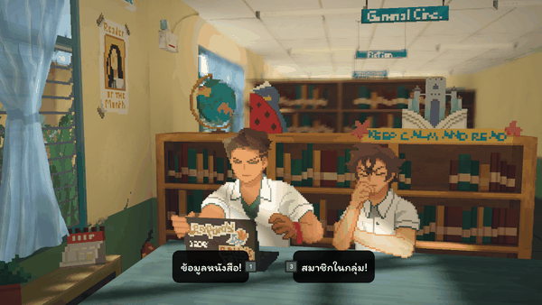
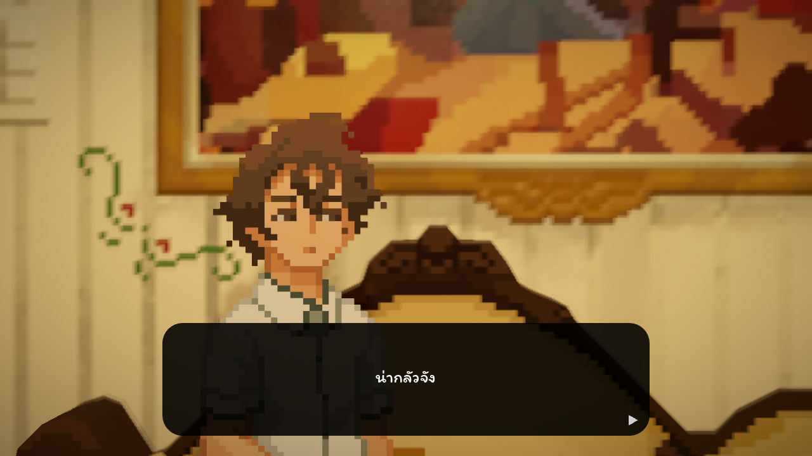
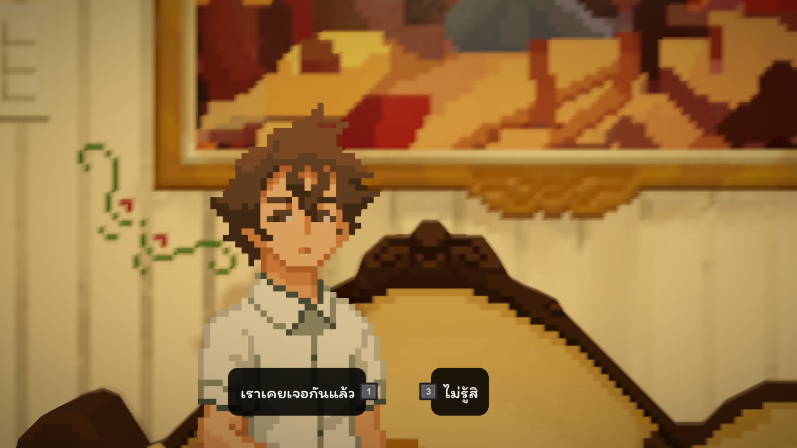

# 🌇 Until Then — แพตช์ภาษาไทย

### แปลไทยทั้งเกม — เนื้อเรื่อง • DLC • UI • ฐานข้อมูล • ฟอนต์

แพตช์แปลภาษาไทยแบบแฟนเมดสำหรับวิชวลโนเวล **Until Then** ของ Polychroma Games
*An unofficial, fan-made Thai localization for the game **Until Then**.*

 

 

## [ ⬇️ &nbsp; ดาวน์โหลดแพตช์ล่าสุด &nbsp; ](../../releases/latest)

*ปิดเกม → แตกไฟล์ → ดับเบิลคลิก `INSTALL.bat` → เปิดเกม → Settings → Language → **ภาษาไทย***

---

| กล่องบทพูดภาษาไทย | ตัวเลือกบทสนทนา |
|:---:|:---:|
|  |  |

ภาพจากในเกมจริง — ฟอนต์ Itim, เวอร์ชันสุภาพกันเอง

---

## ✨ แปลอะไรบ้าง

- 📖 **เนื้อเรื่องหลักครบบทที่ 1–10 + บทเสริม** และ **DLC *Afterimages*** — ~23,000 บรรทัด
- 🗨️ **UI / เมนู / บทกวีเปิด–ปิดเกม** และ **ฐานข้อมูลในเกม** (อีเมล แชต โซเชียล ข่าว)
- 🔤 **ฟอนต์ไทยฝังในตัว** เลือกได้ 2 แบบ — **Itim** (กลมน่ารัก) หรือ **Sarabun** (เรียบทางการ)
- 🎭 **2 โทนภาษาในไฟล์เดียว** — สุภาพกันเอง (เหมาะทุกวัย) และแบบเพื่อนสนิท

---

## 🎯 จุดเด่นของงานแปล

- **ถูกต้องเรื่องเพศตัวละคร** — ตรวจเพศจากฐานข้อมูลตัวละครในเกม + ดูจากสไปรท์จริงของ NPC
  (โดยเฉพาะตัวละคร DLC) เพื่อให้คำลงท้าย (ครับ/ค่ะ) และสรรพนามถูกต้อง
- **คงโครงสร้างเกมครบ** — รักษาแท็กพิเศษ (`[wave]`, `[shake]`, จังหวะ `[.]`, คำสั่ง `$`) ไว้ไม่ให้เกมพัง
- **ตัดคำไทยถูกต้อง** — ทำตัวตัดคำไทยเองให้บับเบิลบทพูดและแชตมือถือ ไม่ตัดกลางคำ/สระลอย
- **ตรวจทานทั้งเกม** — ไล่ตรวจภาพหน้าจอจากระบบเล่นอัตโนมัติ + สแกนไฟล์หาคำแปลตกหล่น

---

## 📥 วิธีติดตั้ง (สำหรับผู้เล่น)

1. ต้องมีเกม **Until Then** บน Steam อยู่ก่อน
2. ดาวน์โหลดจากหน้า [**Releases**](../../releases/latest) — เลือกฟอนต์ที่ชอบ (`_Itim` หรือ `_Sarabun`)
3. **บันทึกและปิดเกมก่อน** — ผู้ใช้จัดการ Steam เอง ตัวติดตั้งไม่สั่งปิดหรือรอ Steam
4. แตกไฟล์ `.zip` แล้วดับเบิลคลิก `INSTALL.bat` (ตัวติดตั้งจะหาโฟลเดอร์เกมเองและสำรองไฟล์เดิมให้)
5. เปิดเกม → Settings → Language → **ภาษาไทย**
   *(อยากได้เวอร์ชันแบบเพื่อนสนิท เลือก Filipino)*

> ถอนการติดตั้ง: รัน `UNINSTALL.bat` หรือคืนไฟล์ `UntilThen.pck.bak`

ตัวติดตั้งรุ่น 9 ต.ค. 2026 ใช้บัฟเฟอร์ไฟล์ 1 MB และทำงานทีละขั้น เพื่อลดการใช้แรม
ตรวจเนื้อหาทุกไฟล์ก่อนแทนที่เกม และเก็บแบ็กอัปเดิมไว้ ทั้งติดตั้งและถอนต้องมีพื้นที่ว่างประมาณ 4 GB
ติดตั้งและถอนได้แม้ Steam ยังเปิดอยู่ ถ้าเกมปิดแล้วและไฟล์ไม่ถูกล็อก
อย่าเปิดเกมหรืออัปเดต/ตรวจไฟล์ Until Then ระหว่างติดตั้ง อ่านรายละเอียดได้ใน [คู่มือตัวติดตั้ง](installer/INSTALL_README.txt)

### 🛠️ แก้ปัญหาที่พบบ่อย
- **ติด `Checksum mismatch: res://.godot/extension_list.cfg`** — [ดาวน์โหลดตัวตรวจไฟล์](https://github.com/skylamiao3o-sys/untilthen-thai-mod/releases/download/v1.0/UntilThen_CheckFiles_20261009_r1.zip) แตก ZIP ลงโฟลเดอร์ใหม่ แล้วเปิด `CHECK_FILES.bat` และส่ง `diagnostic.log` กลับมา
  ตัวตรวจจะระบุว่าเลือก `.pck` หรือ `.bak` พร้อมเทียบ checksum ของตัวอย่างข้อมูล โดยไม่แก้ไฟล์เกมและไม่ปิด Steam เป็นเครื่องมือวินิจฉัย ไม่ใช่ตัวซ่อมหรือตรวจครบทั้งเกม
- **ไฟล์เกมถูกล็อก** — ตัวติดตั้งจะหยุดพร้อมแจ้งชื่อไฟล์ ผู้ใช้ปิดเกม/Steam เองแล้วลองใหม่
  ตัวติดตั้งและตัวถอนไม่สั่งเปิด/ปิด Steam ไม่ตรวจหรือรอโปรเซส Steam รายละเอียดอยู่ใน `debug.log` หรือ `uninstall_debug.log`
- **เปิดเกมแล้วขึ้น `Couldn't load project data ... Is the .pck file missing?`** = ไฟล์เกมถูกเขียนไม่ครบตอนติดตั้ง มักเพราะ **พื้นที่ดิสก์ไม่พอ** (ต้องว่าง ~4 GB บนไดรฟ์ที่ลงเกม)
  → รัน **`UNINSTALL.bat`** คืนไฟล์เดิม (เกมกลับมาเล่นได้ทันที) → เคลียร์พื้นที่ดิสก์ → ติดตั้งใหม่
  *(ตัวติดตั้งเวอร์ชันใหม่จะ **ตรวจไฟล์ก่อนติดตั้ง** — ถ้าสร้างไม่ครบจะไม่ทับไฟล์เกม แล้วเตือนให้เคลียร์ดิสก์แทน)*
- **แอนติไวรัส/SmartScreen เตือน** = false positive (มอดอินดี้ไม่ได้เซ็นใบรับรอง) → More info → Run anyway หรือเพิ่มโฟลเดอร์เกมใน AV exclusions

### 💬 เจอบั๊ก / อยากพูดคุย → Discord
[**https://discord.gg/CarAy7yDy**](https://discord.gg/CarAy7yDy) — รายงานบั๊ก แจ้งจุดแปลผิด/เพศตัวละคร หรือพูดคุยได้เลย
*(ถ้าติดปัญหาตอนติดตั้ง ช่วยแนบไฟล์ `debug.log` ที่อยู่ข้างๆ `INSTALL.bat` มาด้วย)*

---

## ✨ ที่มาและเครดิต

โปรเจกต์นี้เกิดจากความรักในเกม และอยากให้คนไทยได้สัมผัสเรื่องราวของ Until Then เป็นภาษาตัวเอง

- **แรงบันดาลใจ — พี่เอก HRK (HEARTROCKER)**
  ได้แรงบันดาลใจในการลงมือทำจากพี่เอก และนำสำนวน/ถ้อยคำบทกวีเปิด–ปิดเกมในเวอร์ชันของพี่เอกมาใช้
  (มีเครดิต *"by HEARTROCKER"* กำกับไว้ในเกมด้วย) ขอบคุณที่เป็นจุดเริ่มต้นครับ 🙏

- **เครื่องมือช่วยทำงาน — Claude (AI ของ Anthropic)**
  ใช้ AI เป็น **เครื่องมือหนึ่งในกระบวนการสร้างสรรค์** ไม่ใช่คนแปลแทนทั้งหมด โดยหลักๆ คือ
  - **อ่านและสรุปเนื้อเรื่องทั้งเกม** เพื่อให้ผู้แปลเข้าใจบริบทภาพรวม ความสัมพันธ์ของตัวละคร
    และอารมณ์ของแต่ละฉาก *ก่อน* ลงมือแปล → ช่วยให้คำแปลสอดคล้องและแม่นเรื่องบริบทมากขึ้น
  - ช่วยเขียน/ดีบักเครื่องมือ (สคริปต์ Python แกะ–ฉีดไฟล์ `.inkb`, โปรแกรมแก้ไขคำแปล C++)

  **การตัดสินใจเรื่องสำนวน โทนเสียง การเลือกคำ ความถูกต้องของเพศตัวละคร และการตรวจทานทุกบรรทัด
  เป็นงานของมนุษย์** AI เป็นเหมือน "เครื่องมือไฟฟ้า" ที่ช่วยทุ่นแรง ไม่ใช่ผู้สร้างผลงาน

- **ผู้จัดทำ / แปล / ตรวจทาน:** แฟนแปลอิสระ (ไม่ประสงค์ออกนาม)

---

## 🧰 เครื่องมือในโปรเจกต์นี้ (What's in this repo)

repo นี้เก็บ **เครื่องมือ (โค้ด) ที่ใช้ทำมอด** — ตัวแพตช์พร้อมติดตั้งอยู่ในหน้า [**Releases**](../../releases)
โค้ดทั้งหมดเป็นผลงานของผู้จัดทำ ใช้เป็น pipeline ในการแปลและประกอบมอด:

| ส่วน | ไฟล์ | หน้าที่ |
|------|------|---------|
| **แกะ/ฉีดบทสนทนา** | `tools/inkb_core.py`, `extract_inkb.py`, `inject_inkb.py` | อ่าน/เขียนไฟล์ Ink binary (`.inkb`) ของเกมแบบ byte-safe |
| **ตรวจความปลอดภัย** | `tools/validate_inkb.py`, `deep_test.py` | เช็คว่าไฟล์ที่ฉีดกลับ round-trip ปลอดภัย ไม่ทำเกมแครช |
| **ลงคำแปล** | `tools/apply_translations.py`, `apply_two.py`, `story_*.py` | นำคำแปลลงชีต / จัดการ 2 ระดับภาษา |
| **คุมคุณภาพ** | `tools/char_gender.json`, `vulgar_sweep.py`, `make_review.py` | safety-net เพศตัวละคร, กันคำหยาบ, ทำเอกสารรีวิว |
| **โปรแกรมแก้คำแปล (GUI)** | `tools/UntilThenTranslator/` | โปรแกรม C++ (Dear ImGui + DX11) ธีมนีออน/ไซไฟ: แก้ Story/UI/DB, ค้นหารวม, ปรับธีม/ฟอนต์ |
| **ตัวติดตั้ง** | `tools/sfxstub/stub.cpp` | ตัวแตกไฟล์ในตัว (self-extracting) สำหรับติดตั้งมอด |
| **แพ็กไฟล์แบบใช้แรมน้อย / ตรวจไฟล์เกม** | `installer/LowMemoryPck.cs`, `install_low_memory.ps1`, `steam_guard.ps1` | อ่านเขียน PCK ทีละส่วน ตรวจไฟล์และเกมที่เปิดอยู่ โดยให้ผู้ใช้จัดการ Steam เอง |
| **build ไฟล์ UI** | `tools/transproj/*.gd` | สคริปต์ Godot สร้างไฟล์ `.translation` ภาษาไทย |

> หมายเหตุ: repo นี้ **ไม่มี** ไฟล์เกมต้นฉบับหรือไฟล์คำแปล (เพื่อเคารพลิขสิทธิ์ของผู้พัฒนา) มีแต่ "เครื่องมือ" เท่านั้น

<b>วิธี build โปรแกรมแก้คำแปล (สำหรับนักพัฒนา)</b>

 

ต้องมี Visual Studio 2022 Build Tools (MSVC) และโหลด dependency ใส่ก่อน:
- **Dear ImGui** (สาขา docking) → `tools/UntilThenTranslator/third_party/imgui/`
- **nlohmann/json** (single-header `json.hpp`) → `tools/UntilThenTranslator/third_party/json/json.hpp`

แล้วรัน `tools/UntilThenTranslator/build.bat`
(โฟลเดอร์ `third_party/` ถูก gitignore ไว้เพราะเป็นไลบรารีของผู้อื่น)

---

## ⚖️ ข้อความปฏิเสธความรับผิด (Disclaimer)

- โปรเจกต์นี้เป็นงาน **แฟนเมดที่ไม่เป็นทางการ** ไม่ได้สังกัดหรือได้รับการรับรองจาก **Polychroma Games**
  หรือผู้จัดจำหน่ายเกม Until Then
- ไม่มีการจำหน่าย ไม่แสวงหากำไร และ **ไม่แจกไฟล์เกมต้นฉบับ** — ผู้เล่นต้องเป็นเจ้าของเกมถูกลิขสิทธิ์
- กรุณาสนับสนุนเกมต้นฉบับบน Steam ❤️
- หากผู้พัฒนาต้องการให้นำออก ยินดีดำเนินการทันที

## 📄 License

โค้ดเครื่องมือ (Python / C++ ในโฟลเดอร์ `tools/`) เผยแพร่ภายใต้สัญญาอนุญาต **MIT** (ดู `LICENSE`)
เครื่องหมายการค้า ทรัพย์สินทางปัญญา และเนื้อหาของเกม Until Then เป็นของผู้พัฒนา/ผู้จัดจำหน่าย

 
สร้างด้วย ❤️ เพื่อชุมชนคนเล่นเกมชาวไทย • Made with care for Thai players

